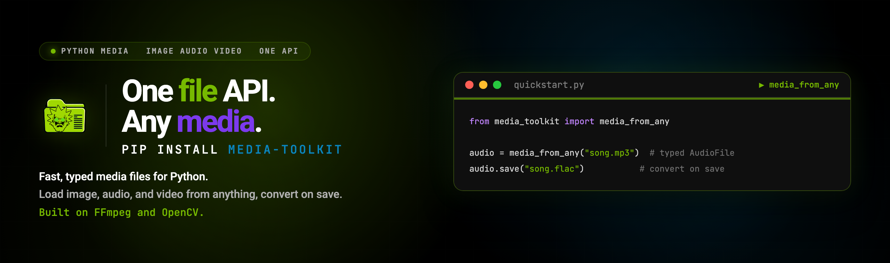

<p align="center">
  
</p>

<p align="center">
  <a href="https://pypi.org/project/media-toolkit/"></a>
  <a href="https://pypi.org/project/media-toolkit/"></a>
  <a href="https://github.com/SocAIty/media-toolkit"></a>
  <a href="LICENSE"></a>
</p>

<h3 align="center">One file API. Any media. Fast, typed, web-ready.</h3>

<p align="center">
  Load image, audio, and video from files, URLs, bytes, base64, or numpy, convert on save.<br>
  Built on FFmpeg (PyAV) and OpenCV for production-grade speed.
</p>

## Install

```bash
pip install media-toolkit
```

Audio and video processing requires FFmpeg. [PyAV](https://github.com/PyAV-Org/PyAV) usually installs it automatically. If needed, install it manually from [ffmpeg.org](https://ffmpeg.org/).

## Quick start

One API for all media types. Load from files, URLs, bytes, base64, or numpy arrays:

```python
from media_toolkit import ImageFile, AudioFile, VideoFile, media_from_any

# Load any file and convert it to the correct type, with smart content detection
audio = media_from_any("media/my_favorite_song.mp3")  # returns AudioFile

# Load from any source
image = ImageFile().from_any("https://example.com/image.jpg")
audio = AudioFile().from_file("audio.wav")
video = VideoFile().from_file("video.mp4")
img = ImageFile().from_base64("data:image/png;base64,...")

# Convert to any format
image_array = image.to_np_array()      # numpy array (H, W, C)
audio_array = audio.to_np_array()      # numpy array (samples, channels)
image_base64 = image.to_base64()       # base64 string
video_bytes = video.to_bytes_io()      # BytesIO object
```

### Batch processing

```python
from media_toolkit import MediaList, AudioFile

# Process multiple files efficiently
audio_files = MediaList([
    "song1.wav",
    "https://example.com/song2.mp3",
    b"raw_audio_bytes..."
])

for audio in audio_files:
    audio.save(f"converted_{audio.file_name}.mp3")  # Auto-convert on save
```

## Image processing

OpenCV-powered image operations:

```python
from media_toolkit import ImageFile
import cv2

# Load and process
img = ImageFile().from_any("image.png")
image_array = img.to_np_array()  # (H, W, C) uint8 array

# Apply transformations
flipped = cv2.flip(image_array, 0)

# Save processed image
ImageFile().from_np_array(flipped).save("flipped.jpg")
```

## Audio processing

FFmpeg/PyAV-powered audio operations:

```python
from media_toolkit import AudioFile

# Load audio
audio = AudioFile().from_file("input.wav")

# Get numpy array for ML and analysis
audio_array = audio.to_np_array()  # (samples, channels) float32 in [-1, 1] range

# Inspect metadata
print(f"Sample rate: {audio.sample_rate} Hz; Channels: {audio.channels}; Duration: {audio.duration}")

# Format conversion (automatic re-encoding)
audio.save("output.mp3")   # MP3
audio.save("output.flac")  # FLAC (lossless)
audio.save("output.m4a")   # AAC

# Create audio from numpy
new_audio = AudioFile().from_np_array(
    audio_array,
    sample_rate=audio.sample_rate,
    audio_format="wav"
)
```

Supported formats: WAV, MP3, FLAC, AAC, M4A, OGG, Opus, WMA, AIFF.

## Video processing

High-performance video operations:

```python
from media_toolkit import VideoFile
import cv2

video = VideoFile().from_file("input.mp4")

# Extract audio track
audio = video.extract_audio("audio.mp3")

# Process frames
for i, frame in enumerate(video.to_stream()):
    if i >= 300:  # First 300 frames
        break
    # frame is a numpy array (H, W, C)
    processed = my_processing_function(frame)
    cv2.imwrite(f"frame_{i:04d}.png", processed)

# Create video from images
images = [f"frame_{i:04d}.png" for i in range(300)]
modified_video = VideoFile().from_files(images, frame_rate=30, audio_file="audio.mp3")
```

## Web and API integration

### Native [FastTaskAPI](https://github.com/SocAIty/FastTaskAPI) support

Built-in integration with FastTaskAPI for simplified file handling:

```python
from fast_task_api import FastTaskAPI, ImageFile, VideoFile

app = FastTaskAPI()

@app.task_endpoint("/process")
def process_media(image: ImageFile, video: VideoFile) -> VideoFile:
    # Automatic type conversion and validation
    modified_video = my_ai_inference(image, video)
    # Any media can be returned automatically
    return modified_video
```

### FastAPI integration

```python
from fastapi import FastAPI, UploadFile, File
from media_toolkit import ImageFile

app = FastAPI()

@app.post("/process-image")
async def process_image(file: UploadFile = File(...)):
    image = ImageFile().from_any(file)
```

### HTTP client usage

```python
import httpx
from media_toolkit import ImageFile

image = ImageFile().from_file("photo.jpg")

# Send to API
files = {"file": image.to_httpx_send_able_tuple()}
response = httpx.post("https://api.example.com/upload", files=files)
```

## Advanced features

### Container classes

`MediaList` for type-safe batch processing:

```python
from media_toolkit import MediaList, ImageFile

images = MediaList[ImageFile]()
images.extend(["img1.jpg", "img2.png", "https://example.com/img3.jpg"])

# Lazy loading, files are loaded on access
for img in images:
    img.save(f"processed_{img.file_name}")
```

`MediaDict` for key-value media storage:

```python
from media_toolkit import MediaDict, ImageFile

media_db = MediaDict()
media_db["profile"] = "profile.jpg"
media_db["banner"] = "https://example.com/banner.png"

# Export to JSON
json_data = media_db.to_json()
```

### Streaming for large files

```python
# Memory-efficient processing
audio = AudioFile().from_file("large_audio.wav")
for chunk in audio.to_stream():
    process_chunk(chunk)  # Process in chunks

video = VideoFile().from_file("large_video.mp4")
stream = video.to_stream()
for frame in stream:
    process_frame(frame)  # Frame-by-frame processing

# Video-to-audio stream
for av_frame in stream.audio_frames():
    pass
```

## Performance

MediaToolkit leverages industry-standard libraries for maximum performance:

- FFmpeg (PyAV): professional-grade audio and video codec support
- OpenCV: optimized computer vision operations
- Streaming: memory-efficient processing of large files
- Hardware acceleration: GPU support where available

Benchmarks:

- Audio conversion: roughly 100x faster than librosa and pydub
- Image processing: near-native OpenCV speed
- Video processing: hardware-accelerated encoding and decoding, over 500 FPS for video decoding on consumer-grade hardware

## Key features

- Universal input: files, URLs, bytes, base64, numpy arrays, BytesIO, Starlette upload files, soundfile
- Automatic format detection: smart content-type inference
- Seamless conversion: change formats on save
- Type-safe: full typing support with generics
- Web-ready: native FastTaskAPI integration, plus extras for httpx and FastAPI
- Production-tested: used in production AI and ML pipelines

## Format support overview

| Category | Formats | Integration | Class | Description |
|----------|---------|-------------|-------|-------------|
| Images | `jpg`, `jpeg`, `png`, `gif`, `bmp`, `tiff`, `tif`, `jfif`, `ico`, `webp`, `avif`, `heic`, `heif`, `svg` | Deep | `ImageFile` | OpenCV-powered processing, format conversion, channel detection and more. |
| Audio | `wav`, `mp3`, `ogg`, `flac`, `aac`, `m4a`, `wma`, `opus`, `aiff` | Deep | `AudioFile` | FFmpeg/PyAV-powered, format conversion, sample rate conversion, streaming, metadata extraction. |
| Video | `mp4`, `avi`, `mov`, `mkv`, `webm`, `flv`, `wmv`, `3gp`, `ogv`, `m4v` | Deep | `VideoFile` | Hardware-accelerated encoding/decoding, frame extraction, audio extraction. |
| 3D Models | `obj`, `glb`, `gltf`, `dae`, `fbx`, `3ds`, `ply`, `stl`, `step`, `iges`, `x3d`, `blend` | Shallow | `MediaFile` | Basic file handling, no specialized 3D processing yet. |
| Documents | `pdf`, `txt`, `html`, `htm`, `json`, `js`, `css`, `xml`, `csv` | Shallow | `MediaFile` | Text and document formats, basic file operations. |
| Archives | `zip`, `7z`, `tar`, `gz` | Shallow | `MediaFile` | Archive and compressed file formats, basic file operations. |
| Data | `npy`, `npz`, `pkl`, `pickle` | Shallow | `MediaFile` | Python data serialization formats, basic file operations. |

Deep integration: specialized classes with advanced processing, format conversion, and media-specific operations.

Shallow integration: basic `MediaFile` class with universal file operations, automatic format detection, and standard conversions.

## Contributing

Contributions are welcome. Key areas:

- Performance optimizations
- New format support
- Documentation and examples
- Test coverage
- Platform-specific enhancements

## License

MIT License, see [LICENSE](LICENSE) for details.

---

Built by [SocAIty](https://www.socaity.ai).
